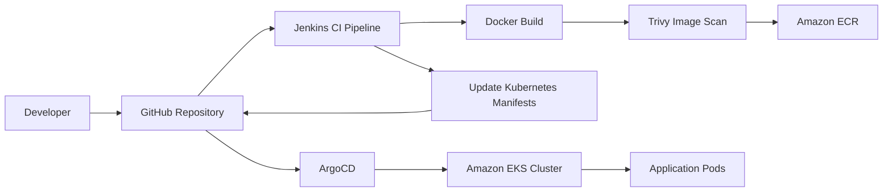
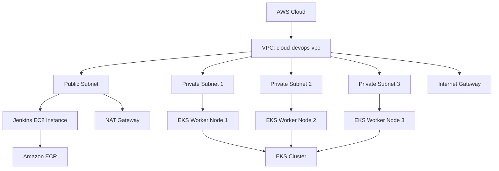
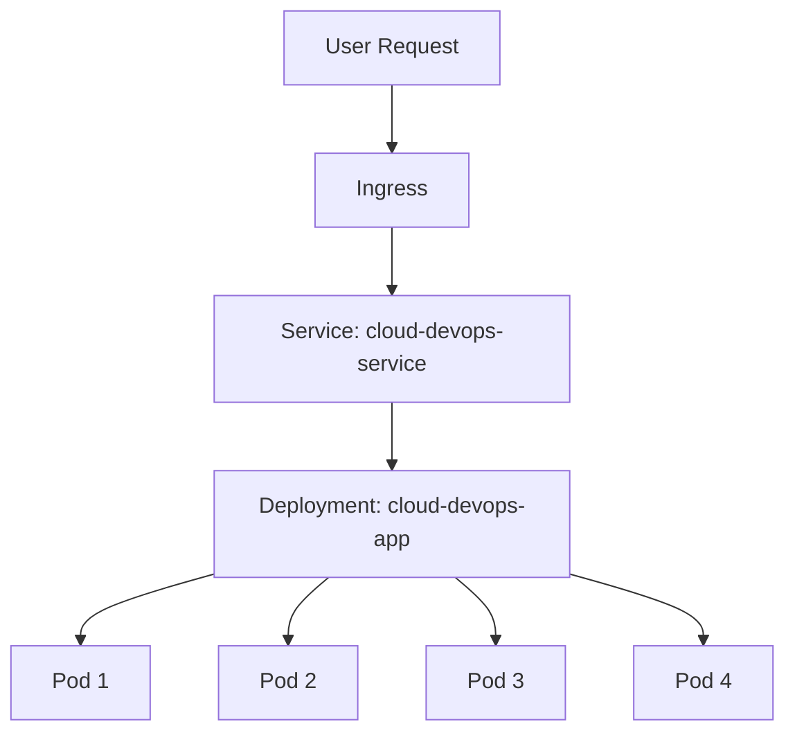

# Architecture Overview

## High-Level Architecture

This project implements a complete DevOps workflow that provisions AWS infrastructure, configures a Jenkins server, builds and scans Docker images, stores images in Amazon ECR, and deploys the application to Kubernetes using ArgoCD GitOps.

---

## AWS Infrastructure Architecture

Terraform provisions the AWS infrastructure using reusable modules.

---

## Kubernetes Architecture

The application is deployed into a dedicated Kubernetes namespace.

---

## CI/CD Workflow

1. Developer pushes code to GitHub.
2. Jenkins pipeline starts.
3. Jenkins builds the Docker image.
4. Trivy scans the image for vulnerabilities.
5. Jenkins pushes the image to Amazon ECR.
6. Jenkins updates the Kubernetes deployment manifest with the new image tag.
7. Jenkins pushes the updated manifest back to GitHub.
8. ArgoCD detects the Git change.
9. ArgoCD syncs the application to the Kubernetes cluster.

---

## Tools Responsibilities

| Tool | Responsibility |
|---|---|
| Terraform | Provision AWS infrastructure |
| Ansible | Configure Jenkins EC2 server |
| Docker | Containerize the application |
| Jenkins | Continuous Integration pipeline |
| Trivy | Security scan Docker images |
| Amazon ECR | Store Docker images |
| Kubernetes | Run application containers |
| ArgoCD | Continuous Deployment using GitOps |
| GitHub | Source code and manifests repository |
